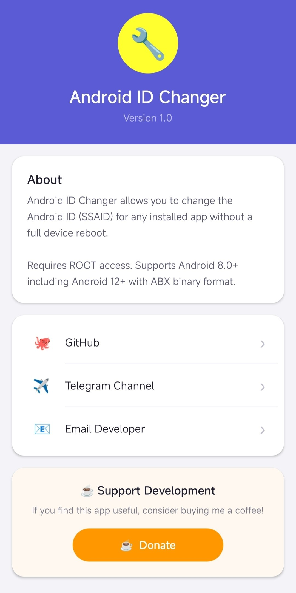

# Android-ID-Changer

🔧 Android ID Changer

  Change Android ID (SSAID) for installed applications without rebooting your device.

  

  
  &nbsp;
  

---

✨ Features

- Change Android ID (SSAID) per application
- No reboot required
- Supports Android 8.0+
- Android 12+ ABX support
- Root access required
- Fast and lightweight

---

❤️ Support Development

If this project helps you, consider supporting its development.

  

---

🔗 Links

- Telegram: https://t.me/ForYouTillEnd
- Donate: https://github.com/RezaArbabBot/Donate

---

  Made with ❤️ by RezaArbabBot

